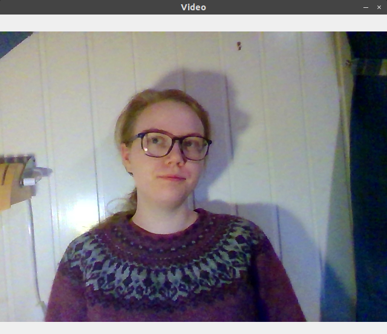
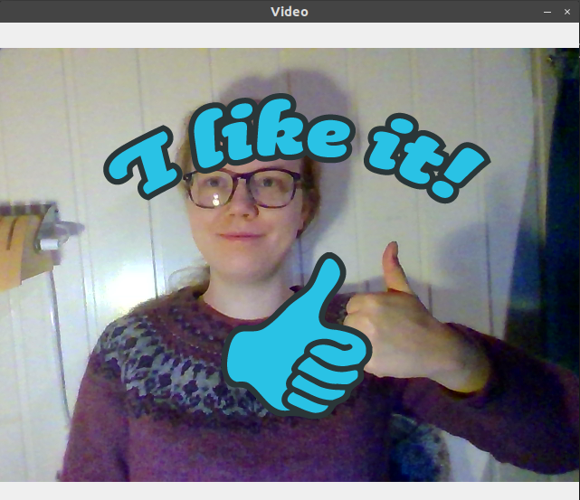
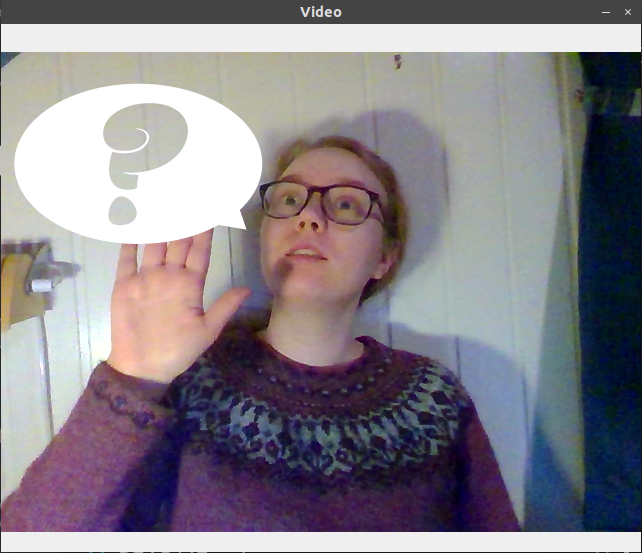
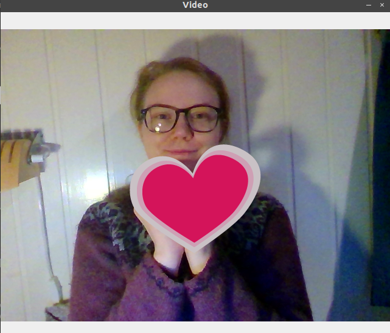
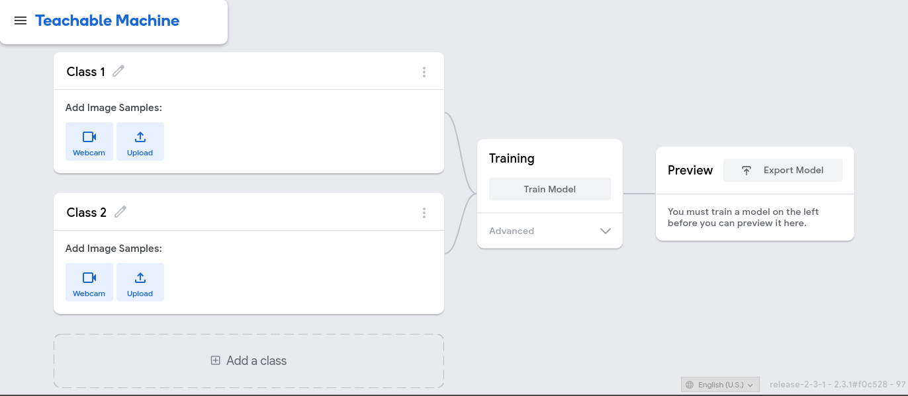
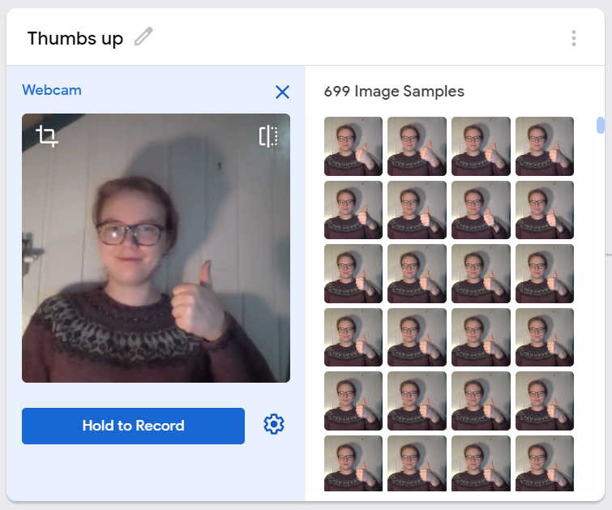
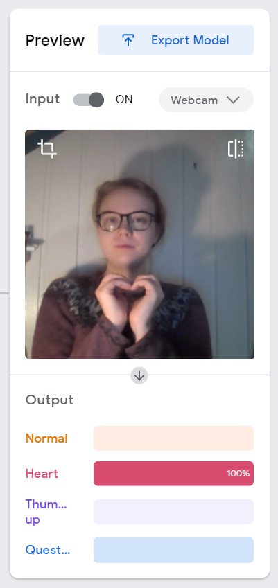

# Create your own webcam stickers in Python
<table>
<tr>
<td></td>
<td></td>
<td></td>
<td></td>
</tr>
</table>

Recently, we watched [this](https://www.youtube.com/watch?v=9z9mbiOZqSs) video by [CodingTrain](https://www.youtube.com/channel/UCvjgXvBlbQiydffZU7m1_aw), where Daniel Shiffman shows how we can create a JavaScript app to add custom stickers to zoom video feeds. We thought this was a really awesome project, and wondered if we could achieve something similar could be with Python instead! Additionally, this seemed to be a good excuse for finally checking out Teachable Machine. 


## Getting a live video-stream in Python
The first step in adding stickers to a live video stream is to obtain this video stream from our web camera. Luckily, it is fairly easy to install OpenCV to obtain and work with such a video stream. First, we installed OpenCV, by using the unofficial `opencv-python` package on PyPI:

    pip install opencv-python

Next, we created a small script where we just showed the output from the WebCamera

```Python
import cv2


vid = cv2.VideoCapture(0) 

while True: 
    ret, frame = vid.read() 
    cv2.imshow('Video', frame) 
      
    # Close the window if `q` is pressed.
    if (cv2.waitKey(1) & 0xFF) == ord('q'): 
        break

# After the loop release the capture object 
vid.release() 

# Close the video window
cv2.destroyAllWindows() 
```

This code will first import OpenCV (which is called `cv2` in Python). Then, we request the computers web camera. Note that while we capture the camera like this, other programs cannot use it. If you try to run the code while the camera is used by another program, the code will crash! After accessing the camera, we have an infinite loop, where we continuously display the web camera's output. OpenCV is a bit odd, so when we show the video stream this way, we cannot close the program by pressing the [x]-button. Instead, we have the `if (cv2.waitKey(1) & 0xFF) == ord('q'):` line, which will close the window if <kbd>q</kbd> is pressed. Then, after the loop, we release the web camera so other programs can use it and close all windows, before exiting the program.

## Training a deep learning model
To train our deep learning model, we use [Teachable Machine](https://teachablemachine.withgoogle.com/), a free, online tool that makes training deep learning models easy! By using it, we can create computer vision models that can classify images. To teach such models to distinguish gestures, we first need to supply our computer with a *training set* — a dataset of images and corresponding labels. 


||
|:----:|
| The Teachable Machine user interface |

Luckily, Teachable Machine also provides an easy-to-use interface to create a training dataset. We can record videos with the web camera for each of the classes. Teachable Machine will then use the video-frames to create a training set that we can use to fit our model. For our expression detector, we used four classes, with about 600 images each:

1. Normal frame
2. Thumbs up
3. Raise hand
4. Heart



After creating the dataset, we trained the deep learning model by pressing the Train Model button. It takes some time, and you cannot switch tabs during the training. If you do, the JavaScript may not be allowed to run. When our model has finished training, we can test it out with the preview window. 

After testing the model, we saw that it worked great! You can see an example where it correctly recognise the "heart" class below. To use this model with our Python script, we pressed *Export Model*, selected the Tensorflow tab and downloaded a Keras .h5 model.



### Behind the scenes
For the technically interested, Teachable Machine uses transfer learning with a MobileNet model that is trained with ImageNet. If you didn't understand what that means, don't worry, it's unnecessary to get this working. Just know that by using this tool, you get to use one of the most accurate yet efficient computer vision models that exist. It was actually invented in 2017!

## Deploying this model locally
To use the deep learning model we just downloaded with Python, we need two additional libraries: TensorFlow for deep learning and Pillow for image processing. Luckily, we can pip-install both these libraries.

    pip install tensorflow pillow

Then, we can make TensorFlow work with our OpenCV video stream.

The first step in classifying our frames is to load the model from Trainable Machine. First, unzip the file you downloaded into a folder you name model, located in the same directory as your scripts. Then, you can add this line on the top of your script (but remember to import `tensorflow.keras` first):

```Python
model = tensorflow.keras.models.load_model('model/keras_model.h5')
```

Next, before we can use OpenCV with TensorFlow, we need to change the loop we created above. OpenCV stores colour in the blue-green-red (BGR) format. Three numbers represent each pixel, the first is how blue the pixel is, the second is how green it is, and the third is how red it is. However, nowadays, we usually have images in the red-green-blue (RGB) format — the colours are in the reverse order compared to OpenCV. Therefore, we must convert the frames from OpenCV before we can use them with TensorFlow:

```Python
ret, raw_frame = vid.read()
frame = cv2.cvtColor(raw_frame, cv2.COLOR_BGR2RGB)
```

The next step is to use this video stream's output as input to our deep learning model. However, the model we trained with Teachable Machine was pre-trained on an extensive collection of images, named ImageNet. This pre-training means that before we trained the algorithm on our data, it already "knew" how to recognise many different photos. We only had to teach it how to recognise five new classes. However, when we train a deep learning model, all images need to have the same size, and ImageNet consists of 224-by-224 pixel images. To ensure that our images are that size, we reshape the video-stream and crop it with the following code (after importing `Image` and `ImageOps` from `PIL`).
```python
# Convert to PIL-style image so we can reshape it correctly
image = Image.fromarray(frame)

# Resize the image to a 224x224 with the same strategy as in TM2:
# Resizing the image to be at least 224x224 and then cropping from the center
size = (224, 224)
image = ImageOps.fit(image, size, Image.ANTIALIAS)

# Turn the image back into a numpy array
image_array = np.asarray(image)
```
Ok, we've reshaped the frame to have the same size as the ImageNet images, and now we want to use TensorFlow to recognise whether we should add a sticker or not. To do that, we must perform two final operations. We should *normalise* the image, converting the pixels to have values between -1 and 1 instead of 0 and 255. And we must reshape the image, so it has shape `(1, 224, 224, 3)`. The singleton axis on the front is necessary because we often want to predict the label of many images at once, and then we have an array with shape `(N, 224, 224, 3)`. In this case, we only have one frame, so we set `N=1`. Luckily, both these operations are quickly done with just one line: 

```Python
data = (image_array.reshape(1, 224, 224, 3) / 127) - 1
```

Now we are ready to use the deep learning model. This is actually one of the easiest tasks today!
```Python
prediction = model.predict(data)
```
The model will give us an array of certainties, signifying which label the model believes the image should have. An array with the values `[0.75, 0.1, 0.05, 0.1]` approximately represents that the model believes there is a 75% chance that the frame should have label 0. If we want to get the label that the model believes is most likely, we can use the `argmax` method in NumPy, and we can print the predicted label to the terminal window:
```Python
image_class = np.argmax(prediction)
print(f"Class: {image_class}")
```

Summarising everything in this section, we get the following program (which is very similar to the example from Teachable Machine):
```Python
import tensorflow.keras
from PIL import Image, ImageOps
import cv2
import numpy as np


model = tensorflow.keras.models.load_model('model/keras_model.h5')


vid = cv2.VideoCapture(0) 

while True: 
    ret, raw_frame = vid.read()
    # OpenCV uses the blue-green-red color system and everyone else
    # use the red-green-blue system, so we need to reorder the channels
    frame = cv2.cvtColor(raw_frame, cv2.COLOR_BGR2RGB)
    # OpenCV does not mirror the image, but teachable machine does.
    frame = frame[:, ::-1]
  
    # Convert to PIL-style image so we can reshape it correctly
    image = Image.fromarray(frame)

    # Resize the image to a 224x224 with the same strategy as in TM2:
    # Resizing the image to be at least 224x224 and then cropping from the center
    size = (224, 224)
    image = ImageOps.fit(image, size, Image.ANTIALIAS)

    # Turn the image back into a numpy array and normalise it
    image_array = np.asarray(image)
    normalized_image_array = (image_array.astype(np.float32) / 127) - 1

    # Load the image into the array
    data = normalized_image_array.reshape(1, 224, 224, 3)

    # Predict which label the image should have
    prediction = model.predict(data)
    image_class = np.argmax(prediction)
    print(f"Class: {image_class}")
    
    # Display the video
    cv2.imshow('Video', raw_frame) 
      
    # Close the window if `q` is pressed.
    if (cv2.waitKey(1) & 0xFF) == ord('q'): 
        break


# After the loop release the capture object 
vid.release() 

# Close the video window
cv2.destroyAllWindows() 
```

## Adding stickers to the video stream
By now, we have a program that takes a video stream from our web camera, displays the stream and prints out which label our machine learning algorithm believes the frame should have. Now, we "just" want to add stickers to the video. To accomplish this, we first have to load our stickers (you can find some example stickers in the `resources` folder)
```Python
# -1 at the end to load alpha channel
stickers = [
    None, # The background class has no sticker
    cv2.imread("resources/heart.png", -1),
    cv2.imread("resources/thumbs-up.png", -1),
    cv2.imread("resources/question.png", -1),
]
```
Then we need a function to overlay these stickers on our video stream.
```python
def overlay_sticker(background, transparent_sticker):
    sticker = transparent_sticker[:, :, :3]
    alpha = transparent_sticker[:, :, 3:].astype('float32')/255 
    background_alpha = 1 - alpha

    return np.uint8(background*background_alpha + sticker*alpha)
```
Finally, in the for loop, we check if the class is not the background class, and if so, we add the sticker before we update the window:
```Python
if stickers[image_class] is not None:
    raw_frame = overlay_sticker(raw_frame, stickers[image_class])
```

Let's test this! 

<table>
<tr>
<td></td>
<td></td>
<td></td>
<td></td>
</tr>
</table>

It seems to work great. You can copy the script below, run the code yourself, or clone this repo and run the `sticker_video.py` script. Though, you should probably train your own model on [Teachable Machine](https://teachablemachine.withgoogle.com/), since our model is not trained on enough images to work for other people.
```Python
import tensorflow.keras
from PIL import Image, ImageOps
import cv2
import numpy as np


def overlay_sticker(background, transparent_sticker):
    sticker = transparent_sticker[:, :, :3]
    alpha = transparent_sticker[:, :, 3:].astype('float32')/255 
    background_alpha = 1 - alpha

    return np.uint8(background*background_alpha + sticker*alpha)

model = tensorflow.keras.models.load_model('model/keras_model.h5')


vid = cv2.VideoCapture(0) 
# -1 at the end to load alpha channel
stickers = [
    None, # The background class has no sticker,
    cv2.imread("resources/heart.png", -1),
    cv2.imread("resources/thumbs_up.png", -1),
    cv2.imread("resources/question.png", -1),
]

while True: 
    ret, raw_frame = vid.read()
    # OpenCV doesn't mirror when we display the image,
    # which can make the video stream look weird.
    raw_frame = raw_frame[:, ::-1]
    
    # OpenCV uses the blue-green-red color system and everyone else
    # use the red-green-blue system, so we need to reorder the channels
    frame = cv2.cvtColor(raw_frame, cv2.COLOR_BGR2RGB)
    # OpenCV does not mirror the image, but teachable machine does.
    
    # Convert to PIL-style image so we can reshape it correctly
    image = Image.fromarray(frame)

    # Resize the image to a 224x224 with the same strategy as in TM2:
    # Resizing the image to be at least 224x224 and then cropping from the center
    size = (224, 224)
    image = ImageOps.fit(image, size, Image.ANTIALIAS)

    # Turn the image back into a numpy array
    image_array = np.asarray(image)

    # Finalise the image array so it can be used by Keras
    data = (image_array.reshape(1, 224, 224, 3) / 127) - 1

    # Predict which label the image should have
    prediction = model.predict(data)
    image_class = np.argmax(prediction)

    # Add the sticker
    print(image_class)
    if stickers[image_class] is not None:
        raw_frame = overlay_sticker(raw_frame, stickers[image_class])
    
    # Display the video
    cv2.imshow('Video', raw_frame) 
      
    # Close the window if `q` is pressed.
    if (cv2.waitKey(1) & 0xFF) == ord('q'): 
        break


# After the loop release the capture object 
vid.release() 

# Close the video window
cv2.destroyAllWindows() 
```

Now we have our very own automatic interactive web camera sticker program. If we want this to work for different people or even different clothes or background, we would probably need to add even more training data to the Teachable Machine. But this already works quite well, and there are endless possibilities for extensions and improvements! 
 
To use this with zoom or any other video conference, you can either share your screen and select the OpenCV video window or use [OBS](https://obsproject.com/) to capture the window and stream it as a virtual camera. 

Many thanks to  [CodingTrain](https://www.youtube.com/channel/UCvjgXvBlbQiydffZU7m1_aw) for the idea! This project was a creative way to explore the possibilities of Teachable Machine and OpenCV in a fun way that is perfect for digital workshops get-togethers.

